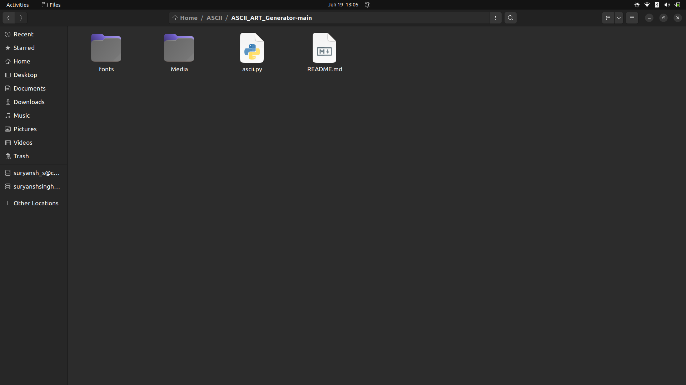
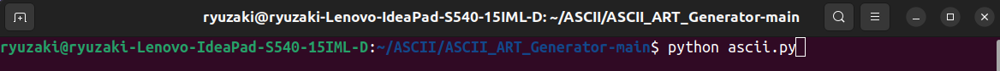
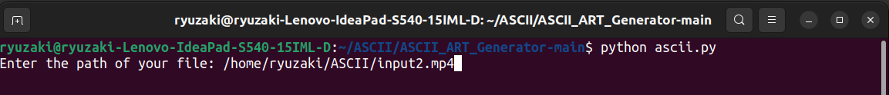
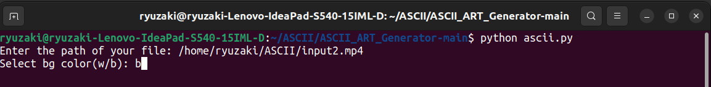
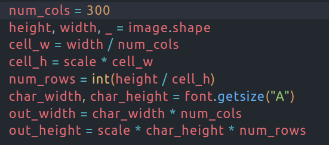
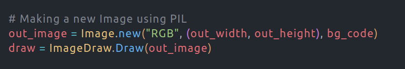
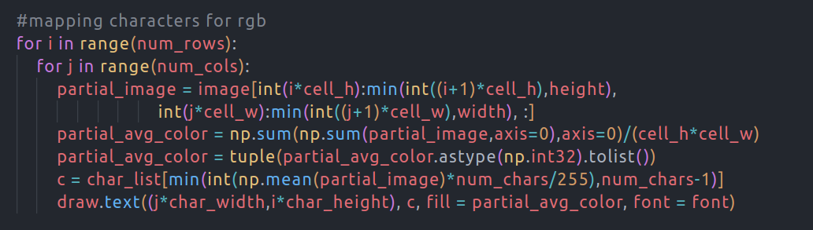
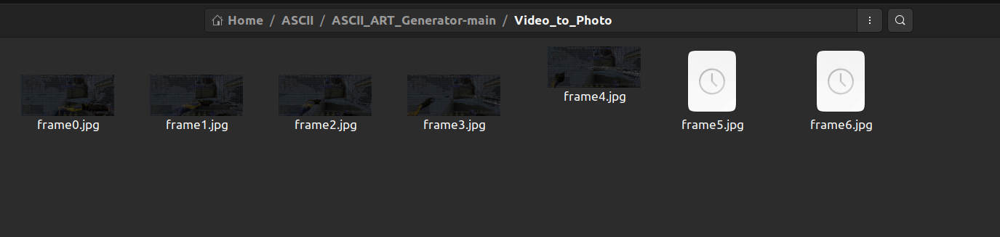
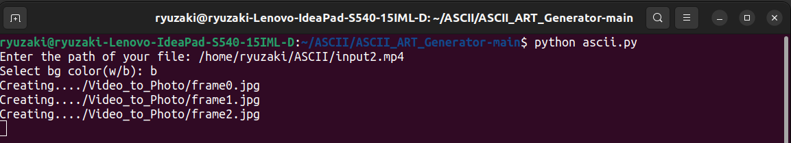
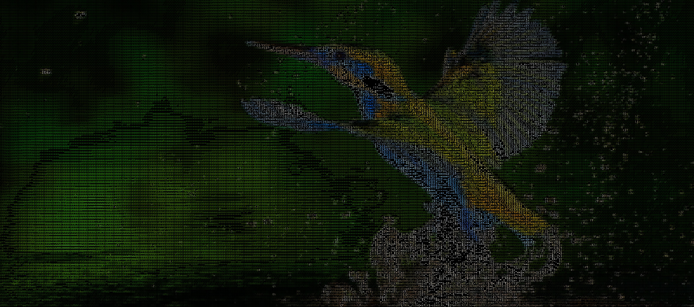

# ASCII Art Generator

This project can be used to generate ASCII art of image aur video files.

## How to use?
1. Clone the repository on your local system.
    
3. Dependencies
    - ```OpenCV``` 
    - ```Numpy```
    - ```OS```
    - ```Shutil```
    - ```PIL```
4. Open terminal and change the location to the directory where you cloned the repository.
6. Enter ```python ascii.py``` to run the code.
    
    
8. Enter the full path of your file(video/image) to generate ASCII art.
    
    
10. Select the background color(White/Black).
    
    
12. It will take some time to generate ASCII art and the output will be saved in cloned directory.

13. Here is the [Link](https://drive.google.com/file/d/1cnwS2pfw0V4ax7UvwjEpEPfqrxOwDvMt/view?usp=sharing) of video of instructions explained above.

## Working
### For image input: 

1. First, we will resize our image by setting number of columns to a specific value.
2. Then calculate height and width of each pixel using the scale factor and no. of cols.
3. Calculate the output width and height using no. of cols, no. of rows and size of ASCII characters.

    

4. Then we will use ```Image``` package of PIL to create an RGB output with given output height, width and background color.
5. We will use ```ImageDraw``` which will act as our paint brush to draw strings at given position.

    
6. We will calculate how many pixels of input image merge to form 1 pixel of output image and use the average color of all those pixels to assign a particular RGB value to output pixel.
 
    
    

7. Finally invert the image and remove excess borders using ```getbbox()``` and save the output image by providing a location.

### For video input:

1. We will create a temporary folder using ```OS``` library.
    
    
3. Using ```VideoCapture``` package from OpenCV we will access each frame and save it to our temporary folder.
4. After saving the frame we will convert it to ASCII art as explained above and replace the frame with ASCII iimage in the temporary folder.
    
    
6. After all frames are converted to ASCII images we will select height, width and FPS and output format for our output video.
7. Using the ```VideoWriter``` package we will join all images to form a video and save the video to specified path.
8. Then delete the temporary folder created with all its contents using ```shutil``` library.
## Demo

- For Image 
    - Input
      
    
    - Output
      

- For Video

    [Input and Output](https://drive.google.com/drive/u/1/folders/1bJTq8nAEfh2IWmnZLv21fvdFZmq0DgKL/)
## References

1. https://medium.com/analytics-vidhya/the-ultimate-handbook-for-opencv-pillow-72b7eff77cd7
2. https://docs.opencv.org/4.x/d7/dbd/group__imgproc.html
3. https://stackoverflow.com/
4. https://pillow.readthedocs.io/en/stable/
